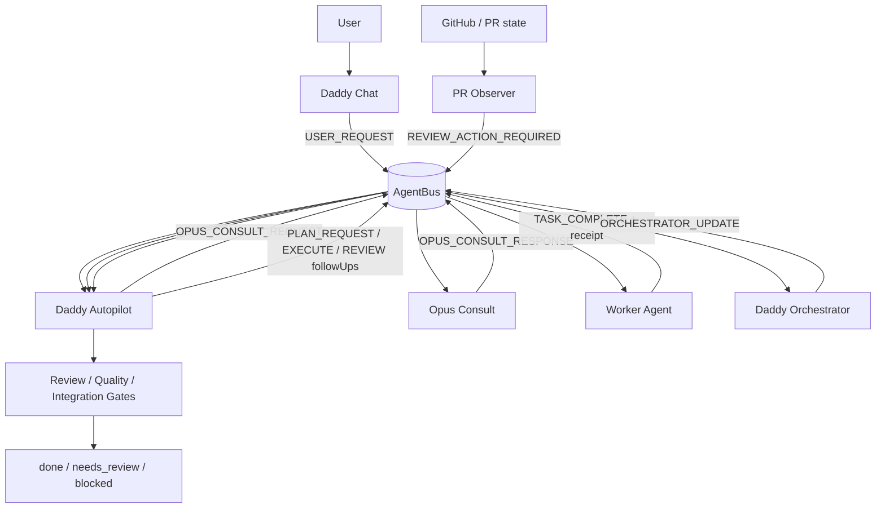
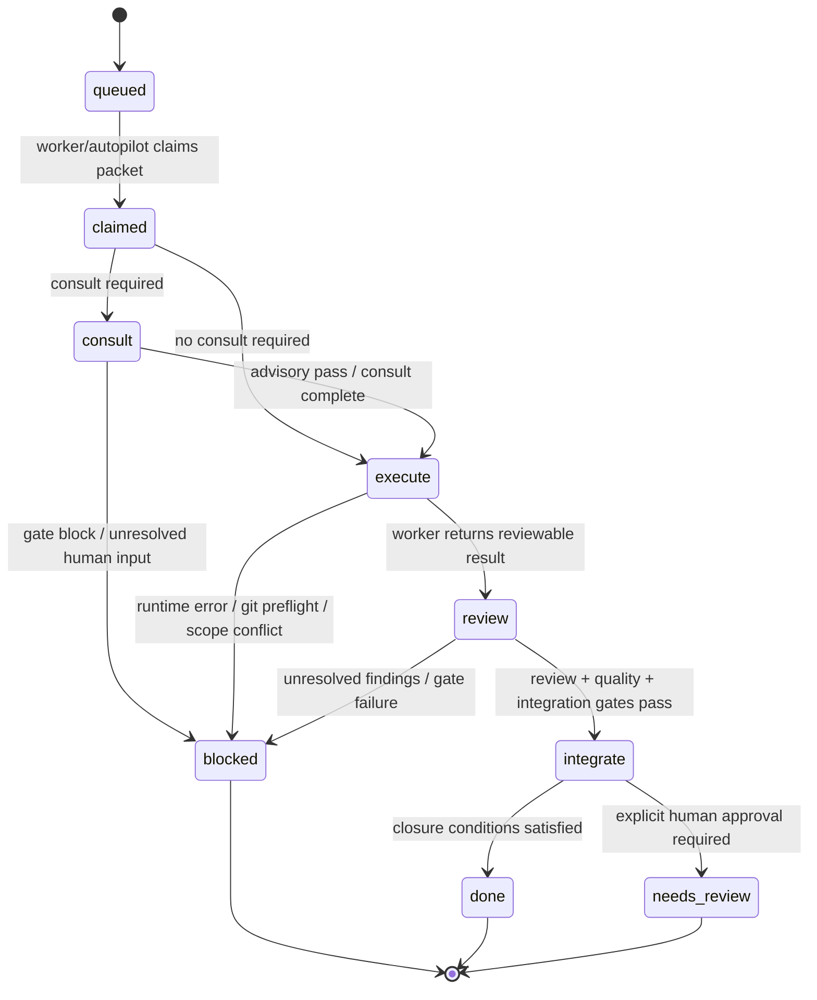
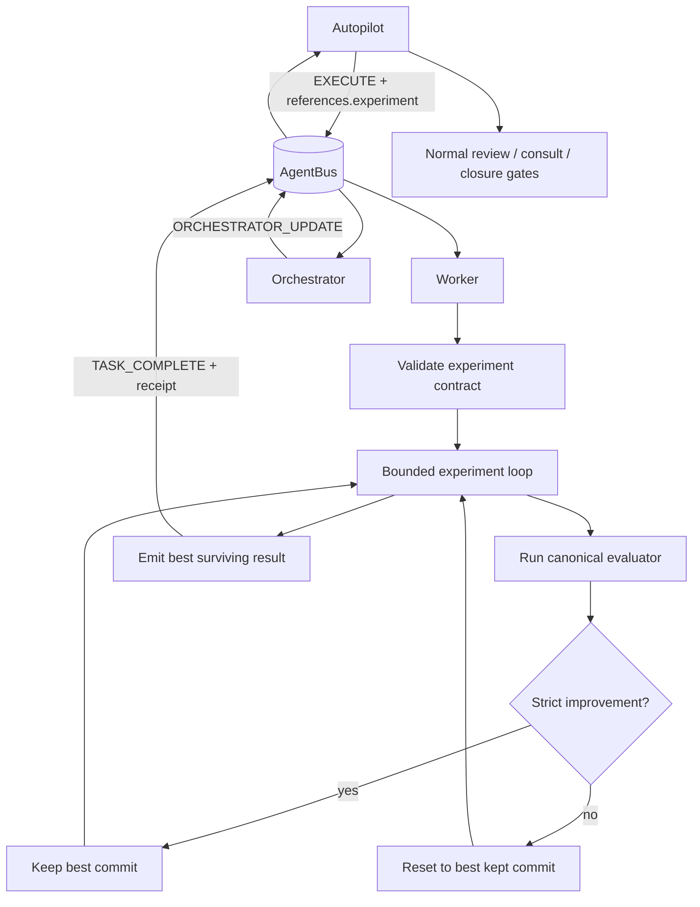

# Autoresearch Experiment Mode Implementation Plan V1

## 1. Summary

Implement a **bounded experiment mode** in `agentic-cockpit` that adapts the useful parts of Karpathy's `autoresearch` loop into the cockpit control plane without importing its unsafe free-running behavior.

This plan is for **cockpit core first**, not Valua-specific code. Valua should inherit it automatically through the existing adapter/runtime path once the feature lands in cockpit.

The core idea is simple:

1. keep the editable surface tightly scoped,
2. run a fixed evaluation command under a fixed budget,
3. keep only strict improvements,
4. discard losing attempts automatically,
5. surface only the best surviving result back to autopilot for normal review/closure.

This is worth doing because it can improve agent quality on tasks that are actually measurable, while reducing speculative churn and reviewer-appeasement slop.

The creator's later follow-up also changes one important planning assumption: if this mode works, the next useful direction is **not** unbounded autonomy, but **massively asynchronous challenger/promotion workflows**. V1 should therefore be designed so later phases can add:
- many independent challenger runs,
- proposal/promotion queues,
- and transfer validation on larger or slower evaluators,
without rewriting the core contract.

## 2. Source Reference (What We Are Adapting)

Primary source repo:
- [`karpathy/autoresearch`](https://github.com/karpathy/autoresearch/tree/c2450add72cc80317be1fe8111974b892da10944)

Key files reviewed:
- [`README.md`](https://github.com/karpathy/autoresearch/blob/c2450add72cc80317be1fe8111974b892da10944/README.md)
- [`program.md`](https://github.com/karpathy/autoresearch/blob/c2450add72cc80317be1fe8111974b892da10944/program.md)
- [`train.py`](https://github.com/karpathy/autoresearch/blob/c2450add72cc80317be1fe8111974b892da10944/train.py)
- [`prepare.py`](https://github.com/karpathy/autoresearch/blob/c2450add72cc80317be1fe8111974b892da10944/prepare.py)
- creator follow-up post:
  - [`x.com/karpathy/status/2031135152349524125`](https://x.com/karpathy/status/2031135152349524125?s=20)

Follow-up post implications (as reviewed from the creator's public summary/update):
- the loop produced many real improvements, not just prompt theater
- improvements appear to transfer to larger/slower validation targets
- the next step is asynchronous collaboration/promotion, not a single forever-running agent

That changes this plan in one concrete way:
- V1 must stay lean, but it should preserve enough structured experiment metadata that Phase 2 can support asynchronous challengers and promotion without replacing the contract shape.

What we are stealing:
- fixed mutation scope
- fixed evaluator boundary
- fixed budget
- keep-or-revert branch progression
- experiment ledger outside normal git history

What we are **not** stealing:
- infinite unattended "never stop" autonomy
- open-ended repo-wide editing
- blind self-modification
- any idea that experiments should bypass normal review/integration/deploy gates

## 3. Problem Statement

Cockpit is strong at:
- routing work,
- dispatching workers,
- reviewing outputs,
- enforcing closure gates.

Cockpit is weak at:
- repeated, metric-driven local search inside a constrained problem,
- automatically discarding bad attempts,
- cleanly separating exploratory commits from promotable commits.

Today, when an agent "optimizes" something, it usually does one of these:
- patches once and claims improvement without a real metric,
- freehands multiple edits with no deterministic keep/revert rule,
- pollutes a branch with failed attempts,
- or makes the controller manually reason about noisy experimental churn.

We need a first-class runtime path for **measured experimentation** that is:
- bounded,
- reviewable,
- deterministic,
- anti-bloat.

## 4. Goals

1. Add a cockpit-native experiment contract for measurable tasks.
2. Reuse existing control-plane structure wherever possible.
3. Keep failed experiments off the final integration branch.
4. Return only the best surviving result to autopilot.
5. Preserve normal review, consult, closure, and deploy gates after the experiment loop.
6. Keep the implementation lean enough that it does not become a second workflow engine.
7. Preserve enough structured metadata that later phases can add async challenger/promotion flows and larger-target confirmation without redesigning the contract.

## 5. Non-Goals

1. No "autonomous research org" framework.
2. No multi-agent experiment swarm in V1.
3. No embeddings/vector memory dependency in V1.
4. No generic self-modifying runtime.
5. No deploy/infra experiments in production paths by default.
6. No new protected-branch bypasses.
7. No GitHub-discussion/PR-mediated swarm machinery in V1.

## 6. Current System (Derived From Repo)

### 6.1 Architecture Diagram (Current)



**Legend / key assumptions**
- `Daddy` is thin human I/O.
- `Autopilot` is the controller.
- Workers perform implementation work in dedicated worktrees.
- `Opus` is consultant infrastructure, not the final authority.
- Review and closure logic stays in autopilot/runtime gates.

**Text map (edges)**
- `User -> Daddy`
- `Daddy -> AgentBus`
- `AgentBus -> Autopilot`
- `Autopilot <-> AgentBus <-> Opus`
- `Autopilot -> AgentBus -> Worker`
- `Worker -> AgentBus -> Orchestrator -> AgentBus -> Autopilot`
- `GitHub -> Observer -> AgentBus -> Autopilot`
- `Autopilot -> ReviewGate -> terminal outcome`

### 6.2 State Machine (Current)



**Legend / key assumptions**
- `consult` is optional and mode-driven.
- `review` includes code-quality, review-output, and closure-gate logic.
- `integrate` is still controller-owned.
- terminal states remain `done`, `needs_review`, or `blocked`.

**State transitions (table)**

| From | To | Condition |
|---|---|---|
| `queued` | `claimed` | agent claims task |
| `claimed` | `consult` | consult gate enabled |
| `claimed` | `execute` | no consult required |
| `consult` | `execute` | consult completed / advisory path |
| `consult` | `blocked` | gate-mode consult block / missing human input |
| `execute` | `review` | executable result returned |
| `execute` | `blocked` | runtime/git/scope failure |
| `review` | `integrate` | required gates passed |
| `review` | `blocked` | review/quality/integration failure |
| `integrate` | `done` | closure evidence complete |
| `integrate` | `needs_review` | human decision still required |

## 7. Proposed V1 Design

### 7.1 Keep Existing Packet Kind; Add Experiment Contract

Do **not** add a brand-new packet kind in V1.

Use existing `signals.kind=EXECUTE` and add a new `references.experiment` contract block. This is the shortest correct path and avoids packet taxonomy bloat.

Proposed contract shape:

```json
{
  "references": {
    "experiment": {
      "enabled": true,
      "allowedPaths": [
        "scripts/lib/task-git.mjs",
        "scripts/__tests__/task-git.test.mjs"
      ],
      "frozenPaths": [
        "scripts/agent-codex-worker.mjs"
      ],
      "evalCommand": "node scripts/code-quality-gate.mjs check --task-kind USER_REQUEST --base-ref origin/main",
      "metric": {
        "kind": "exit_code_then_score",
        "goal": "minimize",
        "parser": "named_capture"
      },
      "metricPattern": "score:\\s+([0-9.]+)",
      "maxIterations": 8,
      "maxWallMinutes": 45,
      "keepRule": "strict_improvement"
    }
  }
}
```

### 7.2 Worker Behavior

When a worker receives `EXECUTE` with `references.experiment.enabled=true`:

1. validate the experiment contract,
2. snapshot the current branch/HEAD,
3. run a bounded experiment loop,
4. keep only the best surviving commit,
5. reset/discard losing attempts,
6. return a normal `TASK_COMPLETE` with the best kept commit (or `blocked` / `failed` if none qualifies).

### 7.3 Experiment Loop

For each iteration:

1. compute the current baseline metric,
2. let the model modify only `allowedPaths`,
3. reject any out-of-scope tracked changes,
4. create a local commit for the attempt,
5. run the evaluator command,
6. parse the metric,
7. compare against the current best,
8. keep the commit only on strict improvement,
9. hard-reset back to the best kept commit when the attempt loses.

V1 rule:
- no improvement means the attempt dies immediately
- only one best line of history survives

### 7.4 Experiment Ledger

Do not commit experiment history to normal git.

Store an untracked ledger under:
- `.codex/experiments/<rootId>/ledger.jsonl`
- optional summary file: `.codex/experiments/<rootId>/summary.json`

Each line records:
- iteration number
- attempt commit SHA
- metric
- status (`keep|discard|crash|invalid`)
- short description
- runtime timestamps
- optional evaluator identity / profile
- optional parent baseline or promoted-from attempt SHA

These extra fields are included now so Phase 2 can promote winners across evaluator tiers without changing the storage shape.

### 7.5 Controller Semantics

Autopilot remains the authority:
- decides whether a task qualifies for experiment mode,
- dispatches the experiment contract,
- reviews the final best commit only,
- then routes normal review/consult/closure from there.

Workers do **not** get to promote failed experiments or bypass normal closure.

### 7.6 Phase-2 Compatibility Rule

V1 should explicitly preserve the ability to add a later **promotion ladder**:

1. fast cheap evaluator finds a local winner,
2. winner is promoted to a slower/stronger confirmation evaluator,
3. only confirmed winners become integration candidates.

V1 should also preserve the ability to add later **asynchronous challengers**:

1. multiple workers run independent bounded experiments,
2. each produces at most one promoted candidate,
3. autopilot compares/promotes candidates instead of allowing direct shared-branch mutation.

That means V1 should keep:
- one structured experiment contract,
- one structured experiment ledger,
- explicit metric/evaluator identity,
- explicit promotion metadata,
- and controller-owned promotion semantics.

## 8. Proposed Runtime Diagram (V1)



## 9. Implementation Scope

### 9.1 Runtime / protocol
- `scripts/agent-codex-worker.mjs`
- `scripts/lib/agentbus.mjs`
- `scripts/agent-bus.mjs`
- `docs/agentic/agent-bus/PROTOCOL.md`
- `docs/agentic/agent-bus/TASK_TEMPLATE.md`
- `docs/agentic/RUNTIME_FUNCTION_REFERENCE.md`
- `docs/agentic/AUTOPILOT_RUNTIME_FLOW.md`
- `docs/agentic/BLUEPRINT.md`

### 9.2 New helper(s)
- `scripts/lib/experiment-contract.mjs`
- `scripts/lib/experiment-ledger.mjs`
- `scripts/lib/experiment-metric.mjs`

V1 rule:
- keep helpers small and single-purpose
- do not build a separate orchestration framework

### 9.3 Tests
- `scripts/__tests__/experiment-contract.test.mjs`
- `scripts/__tests__/experiment-ledger.test.mjs`
- `scripts/__tests__/codex-worker-experiment-mode.test.mjs`

### 9.4 Skills / docs
- `.codex/skills/cockpit-autopilot/SKILL.md`
- `.codex/skills/code-change-verification/SKILL.md` if experiment verification posture needs explicit mention
- `README.md` only if public operator usage is exposed in the CLI surface

## 10. Exact V1 Semantics

### 10.1 Contract validation

Reject experiment mode if any of these are missing or invalid:
- `allowedPaths`
- `evalCommand`
- `metric.kind`
- `goal`
- positive `maxIterations`
- positive `maxWallMinutes`

Fail closed on:
- out-of-scope file edits
- malformed metric output
- evaluator timeout
- attempt to modify frozen paths

### 10.2 Budgeting

Two hard stops:
- iteration budget
- wall-time budget

Whichever hits first ends the loop.

### 10.3 Keep rule

V1 only supports:
- `strict_improvement`

No tie-keeping in V1.
If we later want complexity-weighted tie breaks, add that only with explicit measured need.

### 10.4 Branch hygiene

The worker should leave:
- one best surviving commit on the work branch, or
- no change at all if nothing beat baseline

It should **not** leave a pile of failed experimental commits behind.

### 10.5 No free-running loops

Cockpit must never import autoresearch's open-ended "keep going forever" posture.

Every experiment root must be bounded by:
- explicit contract
- explicit budget
- explicit evaluator
- explicit controller ownership

## 11. Security / Reliability Review

### Strengths if implemented correctly
- less speculative churn
- cleaner branch history
- stronger measured improvement discipline
- better worker behavior on benchmarkable tasks

### Risks
- metric gaming
- evaluator overfitting
- accidental branch pollution
- scope escape into unrelated files
- experiment mode used on tasks that are not actually measurable

### Required safeguards
1. fail closed on out-of-scope edits
2. fail closed on malformed metric output
3. keep experiment history out of protected/integration branches
4. do not use experiment mode for deploy/prod mutation tasks by default
5. preserve all existing review/consult/integration gates after the loop

## 12. Acceptance Criteria

The slice is complete only when all are true:

1. A worker can execute an experiment-mode `EXECUTE` task with a fixed contract.
2. Losing attempts are reverted automatically.
3. Only the best surviving commit remains at branch tip.
4. Out-of-scope file edits fail closed.
5. The experiment ledger is written outside normal git history.
6. Autopilot receives only the best surviving result and continues through normal review/closure.
7. Protocol/runtime docs are updated in the same PR.
8. Regression tests cover keep, discard, malformed metric, scope escape, timeout, and no-improvement outcomes.

## 13. Test Plan

### Unit tests
- parse/validate experiment contract
- parse metric output
- reject malformed metric output
- ledger append/read behavior

### Runtime tests
- worker keeps a strictly better attempt
- worker discards a worse attempt
- worker returns no-change when nothing improves
- worker blocks on out-of-scope edits
- worker blocks on evaluator timeout
- worker blocks on malformed evaluator output
- worker preserves only the best surviving commit

### Controller tests
- autopilot dispatches experiment-mode execute using existing `EXECUTE`
- autopilot treats the returned best commit as a normal reviewable result
- normal review/quality/closure gates still apply after the experiment loop

## 14. Rollout Plan

### Phase 1
- controller-first, single-worker experiment mode
- no multi-agent experiment swarms
- no adaptive planner
- no memory/retrieval coupling
- no second-tier confirmation evaluator in the first implementation

### Phase 2 (only if V1 proves useful)
- richer metric parsers
- optional complexity-aware tie-breaks
- limited experiment templates per downstream repo
- second-tier confirmation evaluators for promotion
- asynchronous challenger runs with controller-owned promotion
- maybe memory-assisted experiment idea recall

## 15. Recommended Branch / PR Strategy

1. Implement in cockpit only.
2. Keep the first PR narrow:
   - contract
   - worker loop
   - ledger
   - tests
   - coupled docs
3. Do not mix adapter-specific behavior into V1.
4. Validate in Valua later by sending a real experiment-mode task through the adapter after merge.

## 16. Definition of Done

This plan is implemented when cockpit can run a bounded, measurable, reversible experiment loop on an existing worker worktree without:
- adding a new control-plane taxonomy,
- polluting final branch history with failed attempts,
- bypassing normal review/closure gates,
- or turning the cockpit into an unbounded autonomous-research toy.
