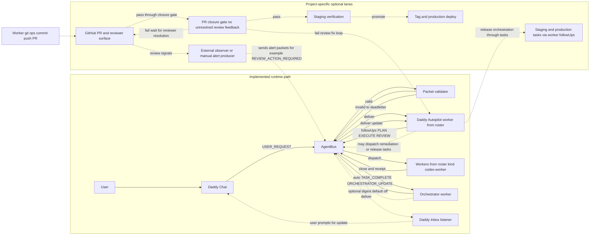

# Agentic Cockpit (V2)

Agentic Cockpit is an open-source, file-backed **AgentBus** + **Codex worker** runtime that can be driven from:

- a tmux cockpit (WSL/Linux-friendly), and
- a local dashboard (WSL/Windows-friendly).

This repo is the **V2** track: it keeps the existing “`codex exec` per attempt” engine as a fallback while adding a new **Codex app-server** engine for cleaner mid-task updates (interrupt → continue the same thread), richer streaming, and better observability.

## Goals
- Deterministic orchestration: everything is auditable via the filesystem bus (tasks + receipts).
- Safe defaults: no secrets in git/logs; guardrails against accidental merges/protected pushes.
- Cross-platform: WSL/Linux first; Windows native optional.

## Workflow Visuals

Implementation-accurate architecture:



Detailed diagrams are in `docs/agentic/WORKFLOW_VISUALS.md`, including the full worktree -> slice PR -> GitHub reviewer loop.

## Quick start (tmux)
1. Ensure you have `node` (>= 20), `tmux`, and `codex` installed and authenticated.
2. Start the cockpit:
   - `bash scripts/tmux/cockpit.sh up`

The default bus root is under `~/.agentic-cockpit/bus` (configurable).

## Local dashboard (port 3000)
The tmux cockpit auto-starts a lightweight local web UI (no build step) on `http://127.0.0.1:3000`.

You can also run it manually:

```bash
npm run dashboard
```

This UI can:
- view bus status + inbox + receipts
- send new tasks
- append updates to in-flight tasks (equivalent to `agent-bus update`)
- cancel queued tasks (marks `skipped` and writes a receipt)

WSL note: open `http://localhost:3000` from your Windows browser while the server runs inside WSL.
If your system can’t auto-open a browser from WSL, the dashboard still prints the URL in the tmux `dashboard` window.

## Using on another project
Agentic Cockpit can drive *any* local repo as long as it has a roster + skills.

Recommended: scaffold the target repo once:

```bash
node /path/to/agentic-cockpit/scripts/init-project.mjs --project /path/to/your-repo
```

Then run the cockpit from inside that repo:

```bash
cd /path/to/your-repo
bash /path/to/agentic-cockpit/scripts/tmux/cockpit.sh up
```

If the repo does not yet have a roster, the tmux launcher will fall back to the cockpit’s bundled `docs/agentic/agent-bus/ROSTER.json` (with a warning).

Tip: avoid `COCKPIT_ROOT=/path ... bash $COCKPIT_ROOT/...` in one line (your shell expands `$COCKPIT_ROOT` before that env assignment applies).

The tmux cockpit auto-starts the dashboard by default. To disable:

```bash
AGENTIC_DASHBOARD_AUTOSTART=0 bash /path/to/agentic-cockpit/scripts/tmux/cockpit.sh up
```

## Worktrees (default)
By default, **codex-worker** agents run in per-agent git worktrees under:
- `~/.agentic-cockpit/worktrees/<agent>`

This isolates agents from each other and from the operator’s working tree.

To disable worktrees (run agents in the current repo checkout):

```bash
AGENTIC_WORKTREES_DISABLE=1 bash /path/to/agentic-cockpit/scripts/tmux/cockpit.sh up
```

To control what new agent branches are based on:
- `AGENTIC_WORKTREES_BASE_REF` (default: `origin/HEAD` if present, else `HEAD`)

## Git Contract (recommended)
For deterministic basing + resumable follow-ups, include `references.git` in code-changing tasks (see `docs/agentic/agent-bus/PROTOCOL.md`).

Workers will use `references.git.workBranch` (and `baseSha` when creating the branch) to ensure they are on the correct branch **before** Codex runs.

To require `baseSha` + `workBranch` for `signals.kind=EXECUTE` tasks:

```bash
AGENTIC_ENFORCE_TASK_GIT_REF=1 bash scripts/tmux/cockpit.sh up
```

## Core CLI
- Initialize a bus: `node scripts/agent-bus.mjs init`
- Send a task: `node scripts/agent-bus.mjs send-text --to autopilot --title "Do X" --body "..." `
- See status: `node scripts/agent-bus.mjs status`

## Configuration
This repo ships with a sample roster at `docs/agentic/agent-bus/ROSTER.json`.

The sample roster uses the built-in skills under `.codex/skills/` (autopilot/planning/execute/qa).

Key env vars (preferred):
- `AGENTIC_BUS_DIR` (bus root)
- `AGENTIC_ROSTER_PATH` (roster json path)
- `AGENTIC_CODEX_ENGINE` (`exec` | `app-server`; core default is `exec` unless an adapter overrides it)

Back-compat:
- `VALUA_AGENT_BUS_DIR`, `VALUA_AGENT_ROSTER_PATH` are still accepted for Valua downstreams.
- `VALUA_CODEX_ENGINE` is also accepted.

## Reducing Exec Burn (Recommended)
These controls exist to reduce token/RPM burn while keeping the filesystem bus as the source of truth.

- Warm start (thread reuse + skip skill re-invocation):
  - `AGENTIC_CODEX_WARM_START=1`
  - Reset pins: `AGENTIC_CODEX_RESET_SESSIONS=1` (or set `AGENTIC_TMUX_HARD_RESET=1` for tmux startup)
- Autopilot context sizing:
  - `AGENTIC_AUTOPILOT_CONTEXT_MODE=full|thin|auto`
  - Default is `auto` when warm start is enabled (thin context only for warm-resumed `ORCHESTRATOR_UPDATE`).
- Compact orchestrator → autopilot digests:
  - `AGENTIC_ORCH_AUTOPILOT_DIGEST_MODE=compact|verbose` (default: compact)
- Optional orchestrator → Daddy digests (operator visibility only):
  - `AGENTIC_ORCH_FORWARD_TO_DADDY=0|1` (default: `0`)
  - `AGENTIC_ORCH_DADDY_DIGEST_MODE=compact|verbose` (default: compact)
- Optional autopilot digest fast-path (zero-token) for allowlisted `ORCHESTRATOR_UPDATE` sources:
  - `AGENTIC_AUTOPILOT_DIGEST_FASTPATH=1`
  - `AGENTIC_AUTOPILOT_DIGEST_FASTPATH_ALLOWLIST="TASK_COMPLETE:STATUS,..."` (default: empty; safe rollout requires care)
- Isolate Codex internal state/index (mitigates cross-project “rollout path missing” spam):
  - `AGENTIC_CODEX_HOME_MODE=agent|cockpit`

## Engines
Engine defaults depend on how cockpit is launched:

- Direct cockpit launch (`bash scripts/tmux/cockpit.sh up`): workers default to **exec** (`codex exec`) for maximum compatibility.
- Valua adapter launch (`adapters/valua/run.sh`): defaults to **app-server** (`AGENTIC_CODEX_ENGINE=app-server`) with warm-start/persistent settings.

To enable the **app-server engine** (recommended for “update/interrupt” workflows):
- `export AGENTIC_CODEX_ENGINE=app-server`

Both engines support AgentBus task updates (`agent-bus update`). With app-server enabled, updates translate to `turn/interrupt` and then continue the **same thread**; with exec they restart the process and resume the session id when possible.

## Metrics (Rollouts)
To quantify token burn by agent/kind from `~/.codex/sessions/**/rollout-*.jsonl`:

```bash
node scripts/rollout-metrics.mjs --help
```

## License
Apache-2.0. See `LICENSE`.
