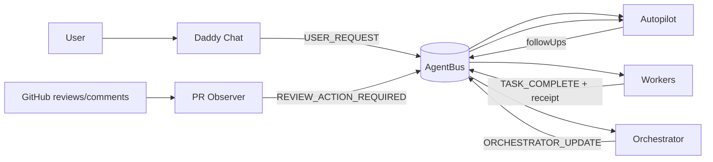

# Autopilot Runtime Flow (Summary)

This file is a concise flow summary.

Authoritative references:
- `docs/agentic/CONTROL_LOOP_AND_PACKET_FLOW.md`
- `docs/agentic/RUNTIME_FUNCTION_REFERENCE.md`
- `docs/agentic/VALUA_ADAPTER_RUNTIME.md`

## Control Loop Summary

## Behavioral Guarantees

- Review gate applies only to successful, reviewable EXECUTE completions.
- Autopilot closure must satisfy configured quality/review/evidence gates.
- Observer/orchestrator packets are control-plane signals, not by themselves proof of merge readiness.

For implementation details (function-by-function), use `docs/agentic/RUNTIME_FUNCTION_REFERENCE.md`.
