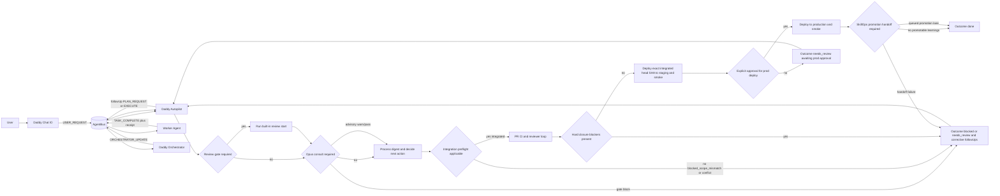

# Daddy Autopilot Runtime Flow (Implementation-Aligned)

This document captures the implementation-aligned controller loop used by cockpit mode, especially through the Valua adapter.
Primary code lives in `scripts/agent-orchestrator-worker.mjs`, `scripts/agent-codex-worker.mjs`, and `docs/agentic/agent-bus/PROTOCOL.md`.

## Runtime Flow

```mermaid
flowchart LR
  U[User] --> DC[Daddy Chat IO]
  DC -- USER_REQUEST --> AB[(AgentBus)]
  AB --> AP[Daddy Autopilot]

  AP -- followUp PLAN_REQUEST or EXECUTE --> AB
  AB --> WK[Worker Agent]
  WK -- TASK_COMPLETE plus receipt --> AB
  AB --> OR[Daddy Orchestrator]
  OR -- ORCHESTRATOR_UPDATE --> AB
  AB --> AP

  AP --> RG{Review gate required}
  RG -- no --> OC{Opus consult required}
  RG -- yes --> RS[Run built-in review start]
  RS --> OC
  OC -- no --> ACT[Process digest and decide next action]
  OC -- advisory warn/pass --> ACT
  OC -- gate block --> BLOCK[Outcome blocked or needs_review and corrective followUps]

  ACT --> IG{Integration preflight applicable}
  IG -- no blocked_scope_mismatch or conflict --> BLOCK[Outcome blocked or needs_review and corrective followUps]
  IG -- yes integrated --> PR[PR CI and reviewer loop]

  PR --> HC{Hard closure blockers present}
  HC -- yes --> BLOCK
  HC -- no --> ST[Deploy exact integrated head SHA to staging and smoke]

  ST --> PA{Explicit approval for prod deploy}
  PA -- yes --> PD[Deploy to production and smoke]
  PD --> SG{SkillOps promotion handoff required}
  SG -- no promotable learnings --> DONE[Outcome done]
  SG -- queued promotion lane --> DONE
  SG -- handoff failure --> BLOCK
  PA -- no --> WAIT[Outcome needs_review awaiting prod approval]

  BLOCK --> AP
  WAIT --> AP
```

## Behavioral Notes

- Review gate applies to successful `TASK_COMPLETE:EXECUTE` digests with a reviewable `commitSha`.
- Opus consult behavior is mode-driven: `advisory` is non-blocking consultant input, `gate` can block on consult failure.
- Integration preflight runs before closure and can block on scope mismatch/conflict.
- Hard closure blocks include unresolved review findings/threads and missing deploy verification evidence.
- Observer-driven `review-fix` freshness is checked before consult, fast-path, git preflight, and any Codex turn:
  - worker reads direct observer metadata from `references.pr/thread/comment`
  - worker reads orchestrator-carried metadata from `references.sourceReferences.pr/thread/comment`
  - stale evidence closes `skipped` with `reasonCode=review_fix_source_superseded`
  - same-head thread/comment re-checks prevent wasted turns on resolved/outdated/edited stale review work, including in-place thread-comment edits via latest-comment `updatedAt`
- Clearly multi-slice `USER_REQUEST` roots (for example multi-PR stacks or body-only `Required order:` workflows with at least three steps) must emit `EXECUTE` followUps in the first autopilot response; packet frontmatter and plain `Scope:` text do not trigger this heuristic, and runtime gives one bounded same-task decomposition retry before it blocks controller-side closeout and falls through to blocked recovery.
- When autopilot closes a root `blocked`, runtime stamps `receiptExtra.blockedRecoveryContract = { class, reasonCode, fingerprint }`, closes the source receipt first, then queues the same-root recovery task; `controller` blockers auto-queue by default, `external` blockers stay bounded by default, repeated identical non-empty recovery fingerprints stop with `unchanged_evidence`, and any post-close enqueue failure is flushed from a deterministic pending marker on the next poll instead of mutating the source receipt.
- Blocked-recovery packets preserve original observer freshness metadata through `references.sourceAgent` + `references.sourceReferences`, including delayed pending-marker replay.
- Advisory Opus remains fail-open, but `review-fix` and `blocked-recovery` turns with advisory items now require one strict line-start `Opus rationale:` note entry for auditability; missing rationale is recorded, not hard-blocked.
- When SkillOps gate is enabled, `distill` is non-durable. Runtime runs `plan-promotions --json` after a successful turn:
  - empty/no-update logs are marked `skipped` locally,
  - non-empty learnings are persisted as a raw plan under AgentBus state, marked `queued`, and handed to a runtime-owned `skillops-promotion` task,
  - only after that durable handoff succeeds may the original root close.
- `skillops-promotion` runs in a shared curation worktree, never commits raw `.codex/skill-ops/logs/**` or `.codex/quality/**`, and closes `needs_review` if push/PR verification or runtime-owned processed mark-back fails.
- When autopilot itself closes a root `blocked`, runtime plans one bounded same-root recovery continuation, closes the source receipt first, then queues the recovery task; if that post-close enqueue fails, a deterministic pending marker is flushed on the next poll instead of mutating the source receipt.
- Production deploy remains gated by explicit human approval.
