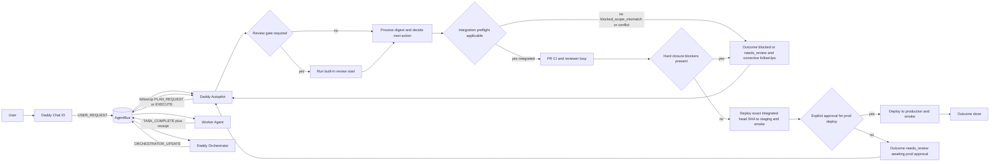

# Daddy Autopilot Runtime Flow (Implementation-Aligned)

This document captures the runtime controller loop used by cockpit mode, especially for the Valua adapter pattern.

It is implementation-aligned with:
- `scripts/agent-orchestrator-worker.mjs`
- `scripts/agent-codex-worker.mjs`
- `docs/agentic/agent-bus/PROTOCOL.md`
- project-local autopilot/chat skills (for example Valua `.codex/skills/**`)

## Runtime Flow

## Behavioral Notes

- Review gate applies to successful `TASK_COMPLETE:EXECUTE` digests with a reviewable `commitSha`.
- Integration preflight runs before closure and can block on scope mismatch/conflict.
- Hard closure blocks include unresolved review findings/threads and missing deploy verification evidence.
- Production deploy remains gated by explicit human approval.

