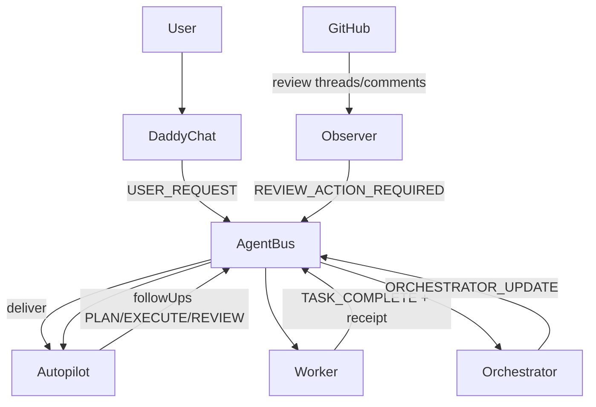

# Control Loop and Packet Flow

This document defines the implementation-aligned control loop across AgentBus, orchestrator, autopilot, workers, observers, and dashboard APIs.

Primary implementation files:
- `scripts/lib/agentbus.mjs`
- `scripts/agent-bus.mjs`
- `scripts/agent-orchestrator-worker.mjs`
- `scripts/agent-codex-worker.mjs`
- `scripts/observers/watch-pr.mjs`
- `scripts/dashboard/server.mjs`

## High-Level Topology

## AgentBus Data Model

Bus root layout:
- `inbox/<agent>/new`
- `inbox/<agent>/seen`
- `inbox/<agent>/in_progress`
- `inbox/<agent>/processed`
- `receipts/<agent>/<taskId>.json`
- `state/**`
- `deadletter/**`

Key operations from `scripts/lib/agentbus.mjs`:
- packet validation + write: `validateTaskMeta`, `writeTaskFile`, `deliverTask`
- read/open/update/claim: `openTask`, `updateTask`, `claimTask`
- close + receipt: `closeTask`, `writeReceipt`
- discovery/status: `listInboxTasks`, `statusSummary`, `recentReceipts`

CLI wrapper (`scripts/agent-bus.mjs`) maps user/operator commands to these operations.

## Task Lifecycle

State transition model:
1. Packet created in `new`
2. Listener/worker open moves to `seen`
3. Worker claims to `in_progress`
4. Worker closes to `processed`
5. Receipt written in `receipts/<agent>`
6. Optional `TASK_COMPLETE` auto-notify sent to orchestrator

Failure-safe behavior:
- suspicious content policy (`block|warn|allow`) is enforced before packet emission
- `update` rejects updates to already `processed` packets

## Packet Kinds and Semantics

Common `signals.kind` values:
- `USER_REQUEST`: user-originated work request
- `PLAN_REQUEST`: plan-only generation request
- `EXECUTE`: implementation work request
- `TASK_COMPLETE`: completion notice emitted by close path
- `ORCHESTRATOR_UPDATE`: digest packet from orchestrator
- `REVIEW_ACTION_REQUIRED`: observer alert from PR feedback

Operational rule:
- `TASK_COMPLETE` and `ORCHESTRATOR_UPDATE` are control-plane signals; they are not direct proof that PR review closure is complete.

## Orchestrator Behavior

Implemented in `scripts/agent-orchestrator-worker.mjs`.

Core responsibilities:
1. Consume orchestrator inbox packets
2. Parse `TASK_COMPLETE` and observer alerts
3. Build compact/verbose digest
4. Forward digest to autopilot
5. Optionally forward digest to daddy chat inbox
6. Coalesce duplicate observer digests for same PR root

Review-gate signal derivation:
- `buildReviewGateSignals` only enables review gate when:
  - source packet kind is `TASK_COMPLETE`
  - completed task kind is `EXECUTE`
  - receipt outcome is `done`
  - receipt has reviewable `commitSha`

That prevents non-reviewable/failed completions from incorrectly entering mandatory review mode.

## Worker Behavior (Codex Worker)

Implemented in `scripts/agent-codex-worker.mjs`.

Primary loop:
1. poll inbox for task ids
2. open + claim
3. construct prompt/context/gates
4. execute via selected engine (`exec` or `app-server`)
5. parse structured output
6. validate quality/review/evidence gates
7. dispatch follow-ups
8. close task with receipt

Critical gates in runtime:
- built-in review gate (for review-required digests and explicit review requests)
- SkillOps gate (configurable by task kind)
- code-quality gate (configurable by task kind)
- observer-drain gate (ensures no sibling unresolved observer packets for same root when required)
- task git preflight contract (`references.git` checks and branch alignment)

Key safety mechanics:
- per-agent single-writer lock to avoid duplicate worker concurrency
- app-server session/thread persistence under bus `state/`
- preflight dirty-worktree handling (auto-clean policy toggles)

## Observer Behavior

Implemented in `scripts/observers/watch-pr.mjs`.

Per cycle:
1. list open PRs (optionally filtered by explicit list and min PR)
2. query unresolved review threads
3. query issue comments
4. emit task packets for new unresolved threads
5. emit comment-based tasks when comment text passes actionable filters
6. persist observer watermark state (`lastSeenIssueCommentId`, seen thread ids)

Current behavior caveat:
- comment watermark advances to max seen id each cycle
- comments filtered as non-actionable are still considered seen
- result: a non-actionable classification can suppress future emission for that comment id

This behavior is intentional in code today and should be treated as an explicit operational constraint until changed.

## Dashboard API Integration

Implemented in `scripts/dashboard/server.mjs`.

API responsibilities:
- snapshot status view of bus + roster
- send/update/cancel task operations
- SSE event stream for UI updates

Important: dashboard APIs call the same AgentBus runtime functions; there is no separate state authority.

## Valua Adapter Integration

Adapter bootstrap wires defaults and runtime mode:
- `adapters/valua/run.sh`: default env profile (app-server, gates, policy sync, bus/worktrees)
- `adapters/valua/restart-master.sh`: deterministic runtime worktree reset/repin/reset-state flow

Full adapter mechanics are in `docs/agentic/VALUA_ADAPTER_RUNTIME.md`.

## Completion and Closure Contracts

A task is only done when all required gates for that task kind pass and closure evidence is present.

Autopilot-specific closure constraints:
- do not treat observer+review feedback as complete until review-action queue is drained for the root
- do not claim merge-readiness solely from thread resolution toggles without required verification path

## Practical Debugging Checklist

When behavior appears inconsistent:
1. `node scripts/agent-bus.mjs open-tasks --root-id <ROOT>`
2. `node scripts/agent-bus.mjs recent --limit 50`
3. inspect `state/pr-observer/*.json` for watermark progression
4. inspect tmux panes (`observer`, `cockpit` autopilot/orchestrator panes)
5. verify runtime roster path and workdirs from launcher env
6. verify worker engine and gate env values (`AGENTIC_*`, `VALUA_*`)
