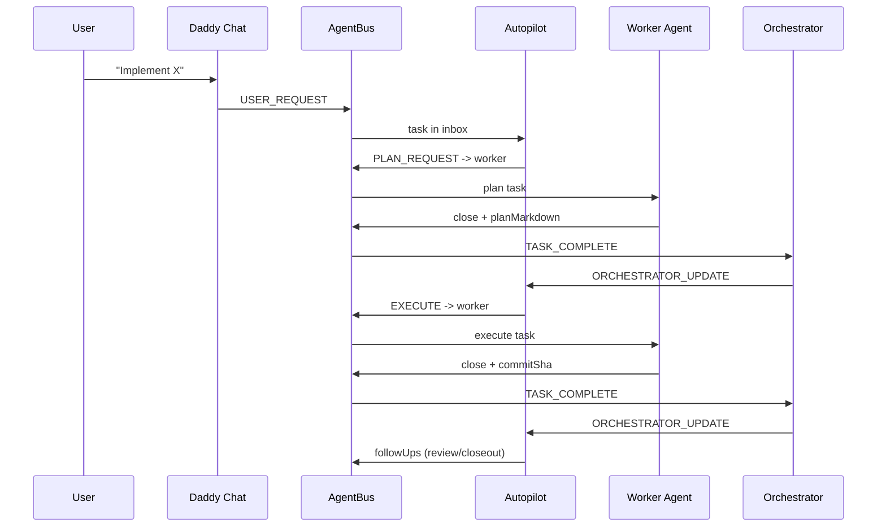
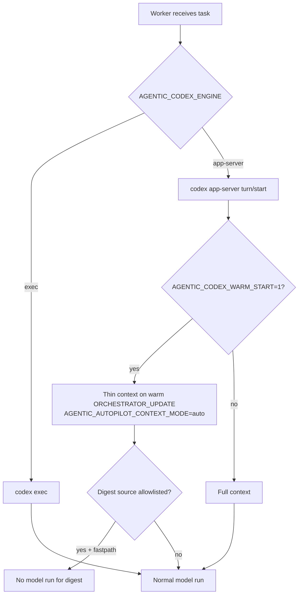

# Agentic Workflow Visuals

These Mermaid diagrams reflect the current cockpit runtime (tmux + AgentBus + workers) and are intended for quick onboarding.

## Runtime Topology

```mermaid
flowchart LR
  User[Operator] --> Chat[Daddy Chat\ninteractive codex chat]
  Chat -->|USER_REQUEST| Bus[(AgentBus)]
  Bus -->|new/seen/in_progress| Workers[Exec Workers\nfrontend/backend/qa/infra/prediction]
  Workers -->|receipt + TASK_COMPLETE| Orch[Orchestrator]
  Orch -->|ORCHESTRATOR_UPDATE\ncompact by default| Auto[Autopilot]
  Orch -->|ORCHESTRATOR_UPDATE\noptional (disabled by default)| Inbox[Daddy Inbox Listener]
  Auto -->|followUps| Bus
  Inbox --> Chat
```

## Plan → Execute → Review Loop



## Token Burn Control Path


