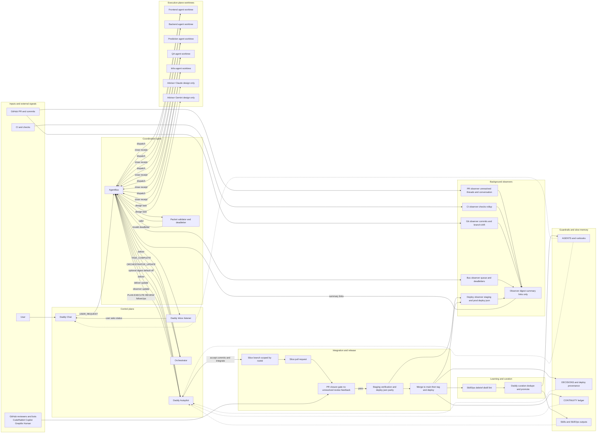
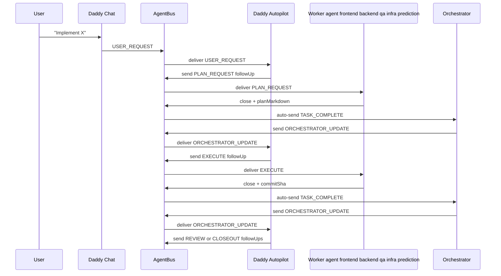
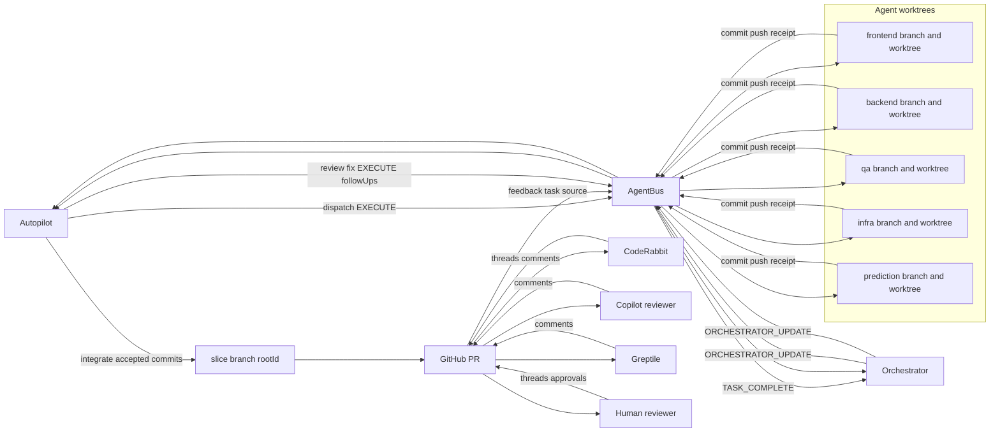
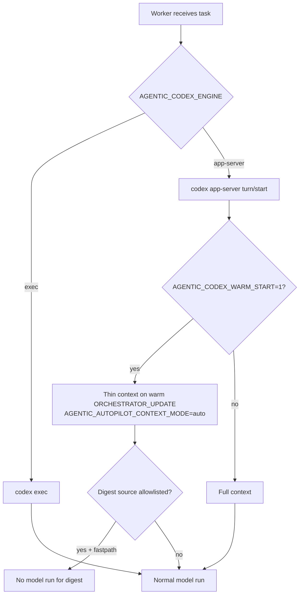

# Agentic Workflow Visuals

These Mermaid diagrams reflect the full cockpit workflow used in production style operation.

## Full System Architecture

## Plan → Execute → Review Loop

## Worktree PR And Reviewer Closure Loop

## Token Burn Control Path

Notes:
- Worktrees are default and isolate each worker branch under `AGENTIC_WORKTREES_DIR/<agent>`.
- Orchestrator is a courier lane from `TASK_COMPLETE` and observer alerts into `ORCHESTRATOR_UPDATE`.
- Autopilot is the controller that dispatches tasks, integrates accepted commits, and drives review closure.
- Review bots and human reviewers feed signals into the same closure loop and are not execution workers.
