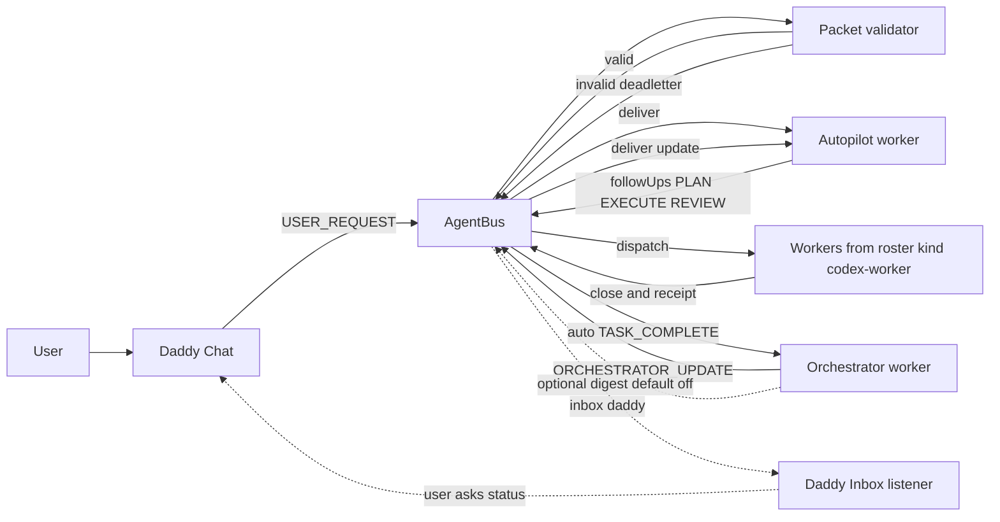
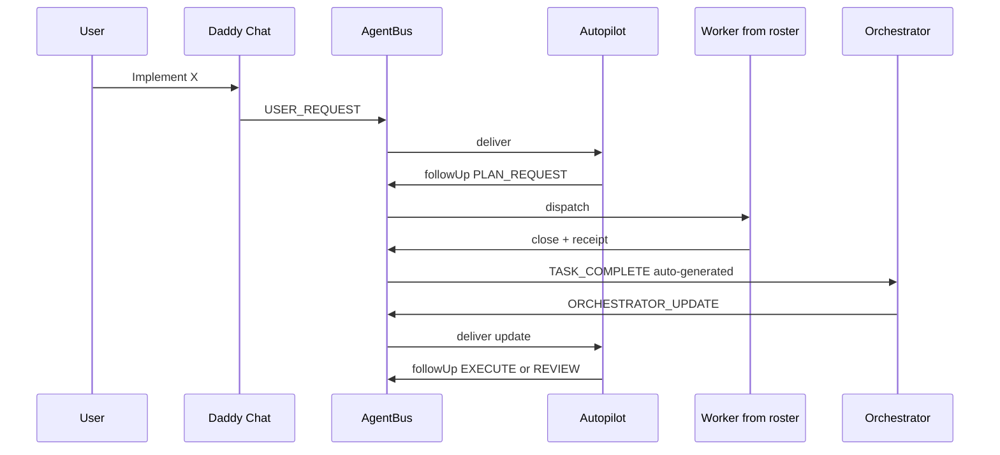
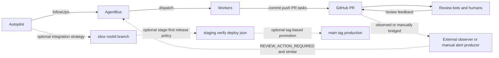

# Agentic Workflow Visuals

These diagrams separate what cockpit runtime implements directly vs project-specific optional flows.

- Solid edges: implemented runtime behavior in `scripts/tmux/agents-up.sh`, `scripts/lib/agentbus.mjs`, and `scripts/agent-orchestrator-worker.mjs`.
- Dashed edges: optional flows driven by roster/skills or external producers.

## Runtime Topology (Implemented)

## Plan Execute Review Courier Loop (Implemented)

## Project Extension Loop (Optional)

## Roster Reality Notes

- Bundled roster currently includes `daddy`, `orchestrator`, `autopilot`, `qa`, and `frontend`.
- Additional workers like backend/infra/prediction appear only when a project roster defines them.
- Advisor panes are optional tmux windows controlled by `AGENTIC_TMUX_AUTOSTART_ADVISORS`.
- Observer processes are not auto-started by default tmux launcher; observer events can still enter via packets.
