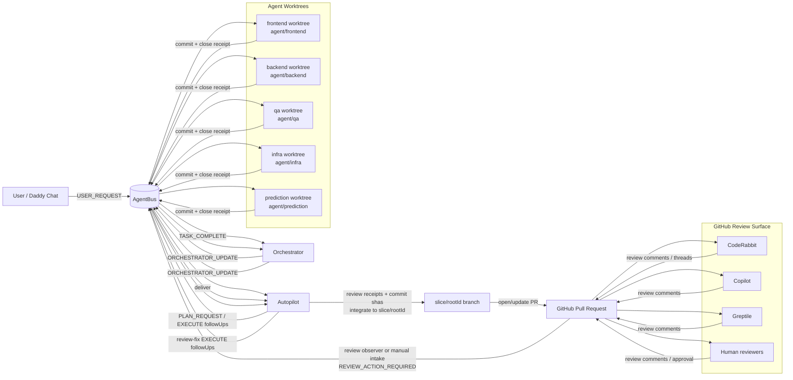

# Agentic Workflow Visuals

These Mermaid diagrams reflect the current cockpit runtime (tmux + AgentBus + workers) and are intended for quick onboarding.

## Runtime Topology

```mermaid
flowchart LR
  User[Operator] --> Chat[Daddy Chat\ninteractive codex chat]
  Chat -->|USER_REQUEST| Bus[(AgentBus)]
  Bus -->|inbox/daddy-autopilot| Auto[Daddy Autopilot]

  subgraph Workers[Exec workers]
    FE[frontend]
    BE[backend]
    QA[qa]
    INF[infra]
    PR[prediction]
  end

  Auto -->|PLAN_REQUEST / EXECUTE / REVIEW followUps| Bus
  Bus -->|dispatch to worker inbox| FE
  Bus -->|dispatch to worker inbox| BE
  Bus -->|dispatch to worker inbox| QA
  Bus -->|dispatch to worker inbox| INF
  Bus -->|dispatch to worker inbox| PR

  FE -->|close + receipt| Bus
  BE -->|close + receipt| Bus
  QA -->|close + receipt| Bus
  INF -->|close + receipt| Bus
  PR -->|close + receipt| Bus

  Bus -->|TASK_COMPLETE| Orch[Orchestrator]
  Orch -->|ORCHESTRATOR_UPDATE\ncompact (default)| Bus
  Bus -->|inbox/daddy-autopilot| Auto

  Orch -->|optional human digest\n(default off)| Bus
  Bus -->|inbox/daddy| Inbox[Daddy Inbox Listener]
  Inbox -->|human prompts for update| Chat
```

## Plan → Execute → Review Loop


## Token Burn Control Path


## End-to-End Delivery Loop (Worktrees + Slice PR + Reviewers)



Notes:
- Workers execute in their own git worktrees by default under `AGENTIC_WORKTREES_DIR/<agent>`.
- Autopilot is the controller: it dispatches work, evaluates receipts, and drives slice/PR progression.
- Orchestrator is a deterministic courier from `TASK_COMPLETE`/alerts back into autopilot.
- GitHub reviewer agents do not execute code directly; they produce review signals that feed back into autopilot review-fix loops.
