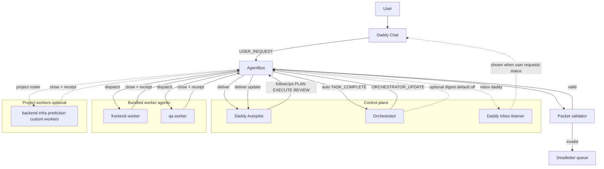
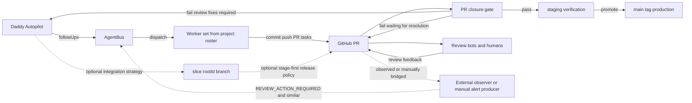

# Agentic Workflow Visuals

These diagrams reflect the cockpit implementation in:
- `scripts/tmux/agents-up.sh`
- `scripts/lib/agentbus.mjs`
- `scripts/agent-orchestrator-worker.mjs`

Legend:
- Solid edges: default runtime behavior.
- Dashed edges: optional or project-defined behavior.

## Runtime Topology (Implemented)

## Bundled Roster Agents

## Plan Execute Review Courier Loop (Implemented)

## Project Extension Loop (Optional)

## Notes

- Bundled roster contains `daddy`, `orchestrator`, `autopilot`, `frontend`, `qa`.
- Additional worker agents are added by project-local roster configuration.
- Advisor panes are optional via `AGENTIC_TMUX_AUTOSTART_ADVISORS`.
- Observer processes are not auto-started by default tmux launcher; observer packets can still enter the bus.
- PR review threads follow a strict closure gate: reply with fix + ask re-check first, then resolve only after verified clean rerun/acknowledgement (`docs/agentic/PR_REVIEW_CLOSURE.md`).
